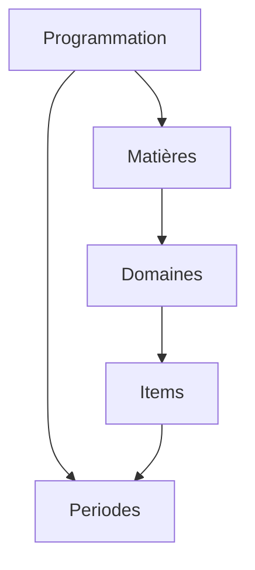

# Teetsh - Test Programmation

## Description

Voici le repos avec le code répondant au test technique de Teetsh!

Le test suit les consignes:

- ~4h (4:08 exactement 😁)
- React/Typescript, initialisé avec Vite et le template react-ts
- Responsive (plus de détail ci-dessous)
- Structuré, maintenable et testé (E2E avec Playwright)

Concernant l'utilisation de l'AI, j'utilise cursor et mon utilisation a été la même que mon utilisation journalière:

- Principalement de l'autocomplete (tab tab tab), accélerant les imports, les refactoring, et les bouts de code simple
- Kickstarter les tests (dans ce cas simple, cela n'a pas été très utile)
- le plus osuvent en mode "Ask" pour avoir le contrôle, plutot que "Agent", qui m'empêche de maintenant un model mental de l'evolution du code

## Choix techniques effectués et leurs justifications

### Styling

J'ai fait le choix d'utilise Tailwindcss pour le style de l'app. C'est bien sur en partie car Teetsh utilise déjà cette technologie :)

D'expérience c'est aussi un très bon compromis pour pouvoir designer "à la voler" avec des guidelines suffisamment rigide pour obtenir un rendu élégant à moindre effort, mais aussi flexible pour le faire évoluer selon des besoins design plus spécifique, et sans compléxifier la componentisation (qui peut s'avérer fastidieuse lorsqu'on doit balader des modules css)

### Pas de librairie externe pour la table

J'ai volontairement souhaité éviter l'utilisation de librairies, en particulier pour le display du tableau de programmation, de manière à pouvoir démontrer mes capacités de development, de layout, et de style.

Pour un usage plus poussé, je considèrerais probablement des libs comme TanStack Table, qui permette une structure plus poussées, et peut être plus maintenable (même si cela serait à discuter).

### Responsivité

Je suis d'avis qu'un code maintenant est aussi un code lisible.

Si j'ai envisagé la possibilité de rendre la programmation responsive en utilisant uniquement du CSS et des media queries, j'ai décidé de prendre l'option d'avoir deux version de la table.

L'une n'est visible que sur mobile (jusqu'à 448px), puis laisse la place à sa version confort.

Avec un bonne componentisation, l'effort pour ajouter la version plus responsive reste minimal, et on augmente la maintenabilité en ayant deux version identifiable et ajustable facilement dans le code.

### E2E tests

J'ai choisi de setup Playwright pour les E2E tests. Bien sûr c'est un peu "overkill" dans ce cas la!

J'aurais pu également ajouter des unit tests ou component tests, mais ca n'aurait pas présenter d'intêret car j'aurais eu peu ou rien à tester. Ils sont plus interessants pour des parties logiques plus poussées dans le front (editeur, selecteur avancée, etc..)

Tous les types de test on leur intêret bien sur, mais d'expérience, pour des produits avec beaucoup de pages et des flow complexes, les E2E apportent plus de valeurs. Ils permettent de garder la flexibilité pour faire évoluer l'interface assez rapidement, tout en s'assurant que les golden paths sont testés.

## Les limites et compromis identifiés

### API State management

Au vue de la compléxité limitée des données, je me suis contenté de récuperer les données dans le composant principal, et de passer au children.

Cela créé une dépendance plus important entre les parents et children, qui peut vite creer des problèmes de maintenabilitée lorsque l'app grandit.

A plus grande échelle, j'obterais pour des solutions qui permettent de cacher les données reçu, éventuellement de les restructurés, et pouvoir les utiliser directement depuis les children. Mécanismes qu'on retrouve avec React Query, RTK Query, Apollo, etc..

### SSR

Pour la simplicité de l'excercice, je me suis contenté d'utiliser directement React avec Vite, plutôt qu'un Framework.

Cela pourrait être suffisant a plus grande échelle tant que le SEO n'est pas capital (dans les parties loggué de l'app, comme c'est le cas dans le dashboard de Teetsh).

Cependant pour les pages publiques, et en particulier pour des pages de "template" comme celle de la programmation, il serait interessant de s'assurer que la page est pre-rendu par le serveur. La solution la plus simple pour cela reste d'utiliser des frameworks pour les pages publiques, comme NextJs, ou bien Astro comme le fait Teetsh.

### Tailwind colors

J'ai pu constater que les couleurs de certains élements sont définis au niveau des data que l'on reçoit.

Tailwind n'est pas un grand fan des elements dynamic puisqu'il scan le code pour generer les classes appropriées.

Je me suis contenté de lui lister dans la feuille de style global les couleurs que j'ai pu trouver dans les data.

À plus grande échelle il faudrait probablement lui specifier de generer toutes les couleurs.

## Les améliorations futures que tu envisagerais si tu devais y passer 2x plus de temps

### Quelques détails de style

Sur la version réduite de la table, j'ai rapidement ajouté une stickiness sur les periodes, pour améliorer l'UX quand on scroll la programmation. Mais il reste des détails de style qui s'overlap derrière le header de la periode.

Soit je prendrais le temps de parfaire cette option (bien que le stickyness est difficile à styliser), ou considererait une autre UX pour le mobile.

### Adjustment du style pour l'impression ou l'export pdf

Il est possible de creer des stylesheet pour targeter specifiquement l'export ou l'impression. Cela serait particulièrement approprié dans ce usecase, ou on compte sur le fait que la programmation soit imprimées par les professeurs.

Cela permettrait de s'assurer que le layout s'ajustera correctement à un A4 par exemple.

### Préparer la gestion de plusieurs programmation

En explorant l'API, j'ai pu voir differents type de programmation, et j'aurais voulu commencer à ajouter un select qui permette de switcher facilement d'une programation a l'autre.

J'ai ajouter celui des matières, mais je n'ai vu aucun exemple avec plusieurs matieres.. 🙈

## Comment modéliserais-tu la programmation en Base de données ? Quelles seraient les routes API à utiliser pour interagir avec depuis le front ?

Les data semblent être connectés de la manière suivante:

Je n'ai pas assez d'information pour savoir si les matières sont réutilisables dans d'autre programmation, si elles ont toujours les même domaines ou non, et de même pour les items. Mais j'imagine que l'on aurait des tables pour chacunes de ces entités, qui aurait des foreign key vers les tables auxquelles elles sont liés.
Cela permettrait ensuite de reconstruire l'information complete d'un programmation, mais aussi de pouvoir acceder plus granulairement à chaque entité

Après l'exploration de l'API `programmation`, j'imaginerais les routes suivantes pour servir les data (un REST très classique)

- `/programmation` - liste des programmations sans les tables liées. Typiquement pour pouvoir display un selecteur ou une liste des programmations disponibles
- `/programmation/[id]` - pour recupere l'ensemble de l'information de la programmation comme c'est le cas actuallement
- `/programmation/[id]/matieres/[id]` - je n'ai pas vu d'exemple avec plus d'une matière. Mais si on venait a avoir une 10e de matières, il serait interessant alors de ne pas renvoyer l'arbre complet avec `/programmation/[id]`, mais uniquement les periodes, et la liste des id des matières. Alors cette route serait utiliser pour recupere les infos nécessaire pour display le tableau pour une matière specifique

Enfin, un seul point d'API, qui tourne l'ensemble des infos d'une programmation, me parait une option sensée dans ce cadre particulier. C'est à priori une page qui sera publique, et qui aura un interêt a être rendu coté serveur pour des questions de SEO, donc granulariser la recuperation des data, ne representerais pas forcement un gain significatif (encore une fois dans ce cas précis).
