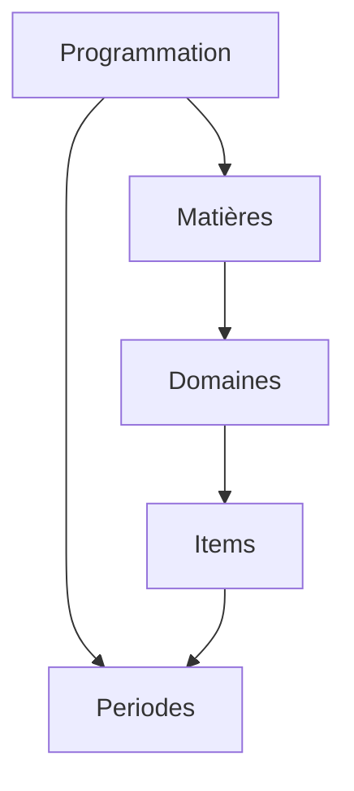

# Teetsh - Test Programmation

## Description

Voici le repos avec le code répondant au test technique de Teetsh!

Le test suit les consignes:

- ~4h (4:08 exactement 😁)
- React/Typescript, initialisé avec Vite et le template react-ts
- Responsive (plus de détail ci-dessous)
- Structuré, maintenable et testé (E2E avec Playwright)

Concernant l'utilisation de l'AI, j'utilise Cursor et mon utilisation a été la même que mon utilisation journalière:

- Principalement de l'autocomplétion (tab tab tab), accélérant les imports, les refactorings, et les bouts de code simples
- Kickstarter les tests (dans ce cas simple, cela n'a pas été très utile)
- Le plus souvent en mode "Ask" pour avoir le contrôle, plutôt que "Agent", qui m'empêche de maintenir un modèle mental de l'évolution du code

## Choix techniques effectués et leurs justifications

### Styling

J'ai fait le choix d'utiliser Tailwind CSS pour le style de l'app. C'est bien sûr en partie car Teetsh utilise déjà cette technologie :)

D'expérience, c'est aussi un très bon compromis pour pouvoir designer "à la volée" avec des guidelines suffisamment rigides pour obtenir un rendu élégant à moindre effort, mais aussi flexible pour le faire évoluer selon des besoins design plus spécifiques, et sans complexifier la componentisation (qui peut s'avérer fastidieuse lorsqu'on doit balader des modules CSS).

### Pas de librairie externe pour la table

J'ai volontairement souhaité éviter l'utilisation de librairies, en particulier pour le display du tableau de programmation, de manière à pouvoir démontrer mes capacités de développement, de layout, et de style.

Pour un usage plus poussé, je considérerais probablement des libs comme TanStack Table, qui permettent une structure plus poussée, et peut-être plus maintenable (même si cela serait à discuter).

### Responsivité

Je suis d'avis qu'un code maintenable est aussi un code lisible.

Si j'ai envisagé la possibilité de rendre la programmation responsive en utilisant uniquement du CSS et des media queries, j'ai décidé de prendre l'option d'avoir deux versions de la table.

L'une n'est visible que sur mobile (jusqu'à 448px), puis laisse la place à sa version confort.

Avec une bonne componentisation, l'effort pour ajouter la version plus responsive reste minimal, et on augmente la maintenabilité en ayant deux versions identifiables et ajustables facilement dans le code.

### E2E tests

J'ai choisi de setup Playwright pour les E2E tests. Bien sûr, c'est un peu "overkill" dans ce cas-là!

J'aurais pu également ajouter des unit tests ou component tests, mais ça n'aurait pas présenté d'intérêt car j'aurais eu peu ou rien à tester. Ils sont plus intéressants pour des parties logiques plus poussées dans le front (éditeur, sélecteur avancé, etc.)

Tous les types de test ont leur intérêt bien sûr, mais d'expérience, pour des produits avec beaucoup de pages et des flows complexes, les E2E apportent plus de valeur. Ils permettent de garder la flexibilité pour faire évoluer l'interface assez rapidement, tout en s'assurant que les golden paths sont testés.

## Les limites et compromis identifiés

### API State management

Au vu de la complexité limitée des données, je me suis contenté de récupérer les données dans le composant principal, et de les passer aux children.

Cela crée une dépendance plus importante entre les parents et children, qui peut vite créer des problèmes de maintenabilité lorsque l'app grandit.

À plus grande échelle, j'opterais pour des solutions qui permettent de cacher les données reçues, éventuellement de les restructurer, et pouvoir les utiliser directement depuis les children. Mécanismes qu'on retrouve avec React Query, RTK Query, Apollo, etc.

### SSR

Pour la simplicité de l'exercice, je me suis contenté d'utiliser directement React avec Vite, plutôt qu'un Framework.

Cela pourrait être suffisant à plus grande échelle tant que le SEO n'est pas capital (dans les parties loggées de l'app, comme c'est le cas dans le dashboard de Teetsh).

Cependant pour les pages publiques, et en particulier pour des pages de "template" comme celle de la programmation, il serait intéressant de s'assurer que la page est pré-rendue par le serveur. La solution la plus simple pour cela reste d'utiliser des frameworks pour les pages publiques, comme Next.js, ou bien Astro comme le fait Teetsh.

### Tailwind colors

J'ai pu constater que les couleurs de certains éléments sont définies au niveau des data que l'on reçoit.

Tailwind n'est pas un grand fan des éléments dynamiques puisqu'il scanne le code pour générer les classes appropriées.

Je me suis contenté de lui lister dans la feuille de style globale les couleurs que j'ai pu trouver dans les data.

À plus grande échelle, il faudrait probablement lui spécifier de générer toutes les couleurs.

## Les améliorations futures que tu envisagerais si tu devais y passer 2x plus de temps

### Quelques détails de style

Sur la version réduite de la table, j'ai rapidement ajouté une stickiness sur les périodes, pour améliorer l'UX quand on scrolle la programmation. Mais il reste des détails de style qui s'overlappent derrière le header de la période.

Soit je prendrais le temps de parfaire cette option (bien que le stickiness est difficile à styliser), ou considérerais une autre UX pour le mobile.

### Ajustement du style pour l'impression ou l'export PDF

Il est possible de créer des stylesheets pour cibler spécifiquement l'export ou l'impression. Cela serait particulièrement approprié dans ce use case, où on compte sur le fait que la programmation soit imprimée par les professeurs.

Cela permettrait de s'assurer que le layout s'ajustera correctement à un A4 par exemple.

### Préparer la gestion de plusieurs programmations

En explorant l'API, j'ai pu voir différents types de programmation, et j'aurais voulu commencer à ajouter un select qui permette de switcher facilement d'une programmation à l'autre.

J'ai ajouté celui des matières, mais je n'ai vu aucun exemple avec plusieurs matières... 🙈

## Comment modéliserais-tu la programmation en Base de données ? Quelles seraient les routes API à utiliser pour interagir avec depuis le front ?

Les data semblent être connectées de la manière suivante:

Je n'ai pas assez d'informations pour savoir si les matières sont réutilisables dans d'autres programmations, si elles ont toujours les mêmes domaines ou non, et de même pour les items. Mais j'imagine que l'on aurait des tables pour chacune de ces entités, qui auraient des foreign keys vers les tables auxquelles elles sont liées.
Cela permettrait ensuite de reconstruire l'information complète d'une programmation, mais aussi de pouvoir accéder plus granulairement à chaque entité.

Après l'exploration de l'API `programmation`, j'imaginerais les routes suivantes pour servir les data (un REST très classique) :

- `/programmation` - liste des programmations sans les tables liées. Typiquement pour pouvoir afficher un sélecteur ou une liste des programmations disponibles
- `/programmation/[id]` - pour récupérer l'ensemble de l'information de la programmation comme c'est le cas actuellement
- `/programmation/[id]/matieres/[id]` - je n'ai pas vu d'exemple avec plus d'une matière. Mais si on venait à avoir une dizaine de matières, il serait intéressant alors de ne pas renvoyer l'arbre complet avec `/programmation/[id]`, mais uniquement les périodes, et la liste des id des matières. Alors cette route serait utilisée pour récupérer les infos nécessaires pour afficher le tableau pour une matière spécifique.

Enfin, un seul point d'API, qui retourne l'ensemble des infos d'une programmation, me paraît une option sensée dans ce cadre particulier. C'est a priori une page qui sera publique, et qui aura un intérêt à être rendue côté serveur pour des questions de SEO, donc granulariser la récupération des data ne représenterait pas forcément un gain significatif (encore une fois dans ce cas précis).
